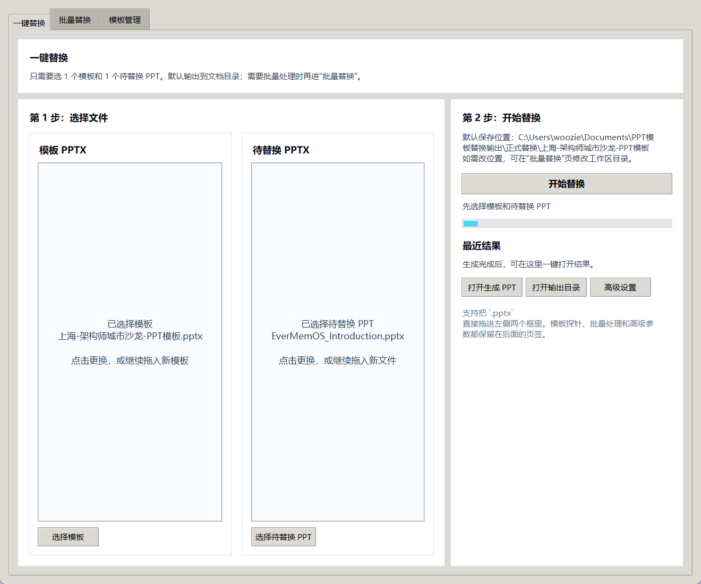
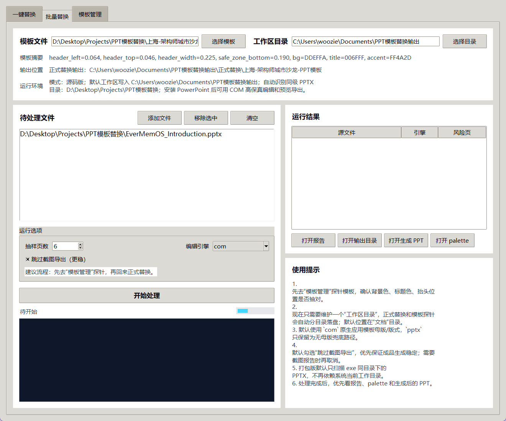
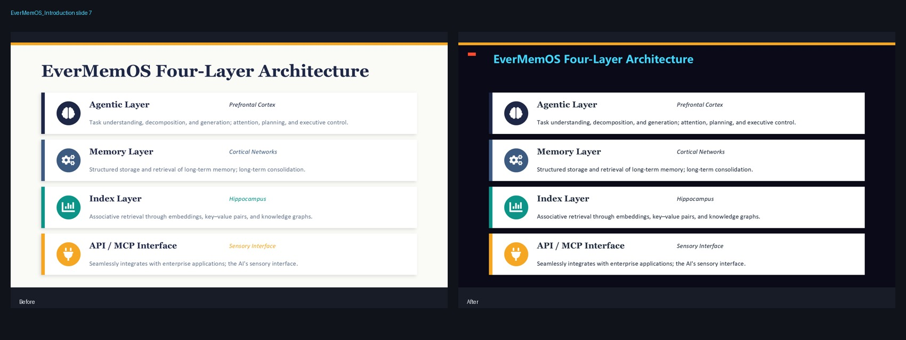

# PPT 模板替换工具

基于 Python、Tkinter、python-pptx 和 PowerPoint COM 的 Windows 桌面原型。用于活动、技术分享和企业培训中，将多份演示文稿适配到统一品牌模板。

## 项目价值与演示

通过 Vibe Coding 将活动运营中的重复套版需求做成桌面工具，集中处理模板选择、批量适配、风险标记和结果交付。AI 用于辅助开发，程序运行时主要依靠规则与 Office 自动化。





历史案例：左侧原稿，右侧主题适配结果。该图来自既有 EverMemOS 案例，不是当前版本重新运行的视觉验收结果。



详见[简历项目介绍](docs/简历项目描述.md)。2026-09-16 本机验证：20 项自动化测试通过，源码及打包程序的 GUI 启动检查通过。

## 启动

需要 Windows。源码运行建议 Python 3.13（本次验证环境），安装依赖后运行：

```powershell
python -m pip install -r requirements.txt
python run_gui.py
```

作品集 ZIP 中的 `app/PPTTemplateReplacer.exe` 为独立打包程序。PowerPoint COM 编辑和预览导出仍需要本机安装 Microsoft PowerPoint；缺失字体会影响版式。双击程序后手动选择模板和源文件。

## 能力与边界

- 一键替换、批量替换、模板管理三个界面。
- 提取模板主题色、字体、背景及安全区；识别标题，调整文字、图表和表格样式。
- 支持 PowerPoint COM 和 python-pptx 编辑路径，带 COM 重试与失败回退。
- 输出 PPTX、风险分析 JSON、Markdown 报告；预览成功导出时生成前后对比图。
- 这是规则驱动的模板适配原型。Vibe Coding 指开发方式，运行时不依赖大模型调用。
- 复杂组合图形、特殊母版和字号继承可能出现内容丢失或错位，交付前需逐页检查。默认 COM 路径并不代表任意模板无损适配。

无需 PowerPoint 预览的源码试运行（路径请用绝对路径）：

```powershell
python run_prototype.py --template "D:\材料\模板.pptx" --source "D:\材料\源稿.pptx" --edit-engine pptx --skip-render --output-root "D:\输出"
```

## 测试与打包

```powershell
python -m unittest discover -s tests -v
python run_gui.py --smoke-test
python -m PyInstaller --noconfirm PPTTemplateReplacer.spec
```

其中分析/主题测试依赖项目根目录中的四个样本：EverMemOS_Introduction.pptx、手把手带你玩转腾讯版自研小龙虾 WorkBuddy.pptx、OpenClaw TVP研讨会-PPT模板.pptx，以及上海-架构师城市沙龙-PPT模板.pptx。作品集 ZIP 包含这些样本；Git 不跟踪大型演示素材。

## 工作区规则

- `prototype_tool/`：业务源码；`tests/`：自动化测试；`scripts/`：辅助脚本。
- `docs/`：作品说明与任务复盘；`deliverables/YYYYMMDD_任务名/`：对外交付产物。
- 历史 archive、release、prototype_runs 和原始业务 PPT 保留原位，不作为源码提交。
- Git 管理源码与文档；发布到外部仓库由项目所有者明确授权后执行。

详见 `docs/简历项目描述.md`、`docs/task-records/20260916_简历作品集交付.md` 和原型使用说明。
